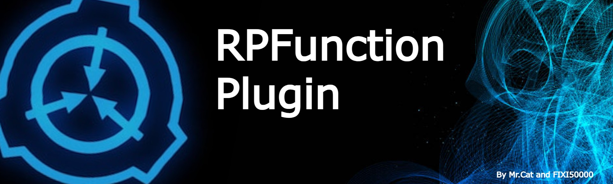
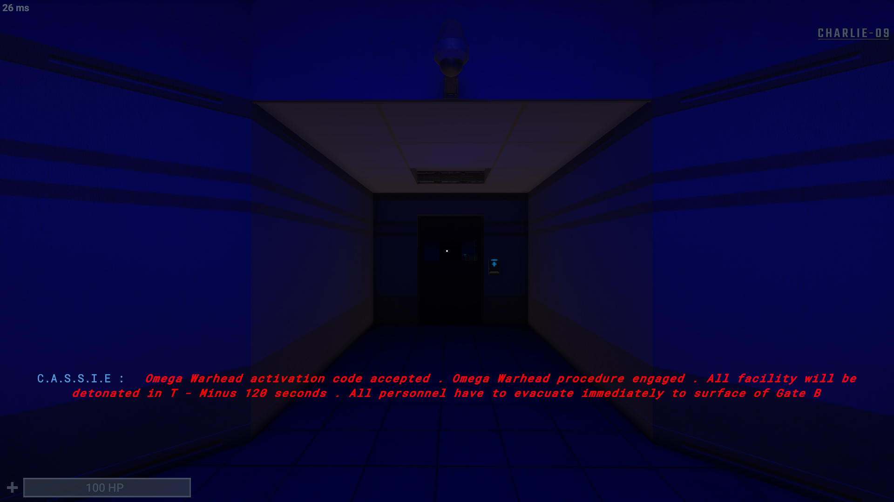
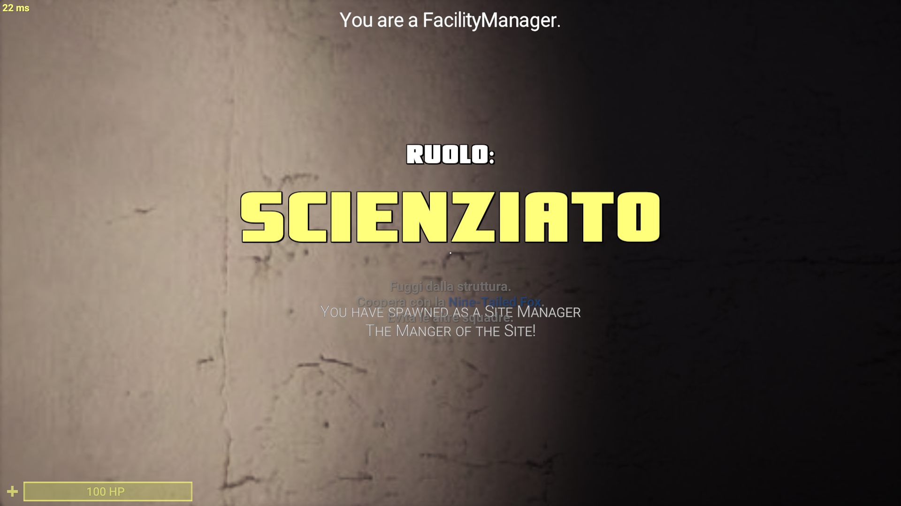
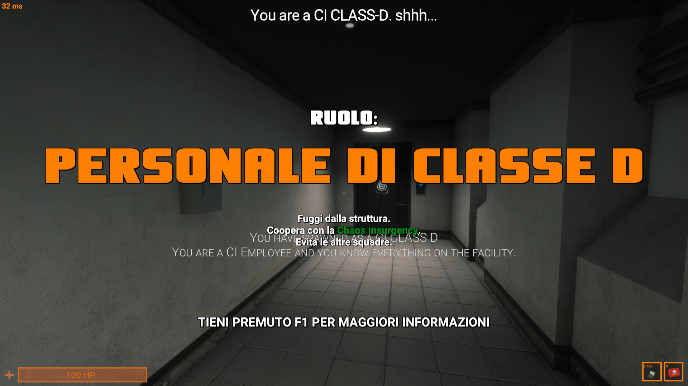
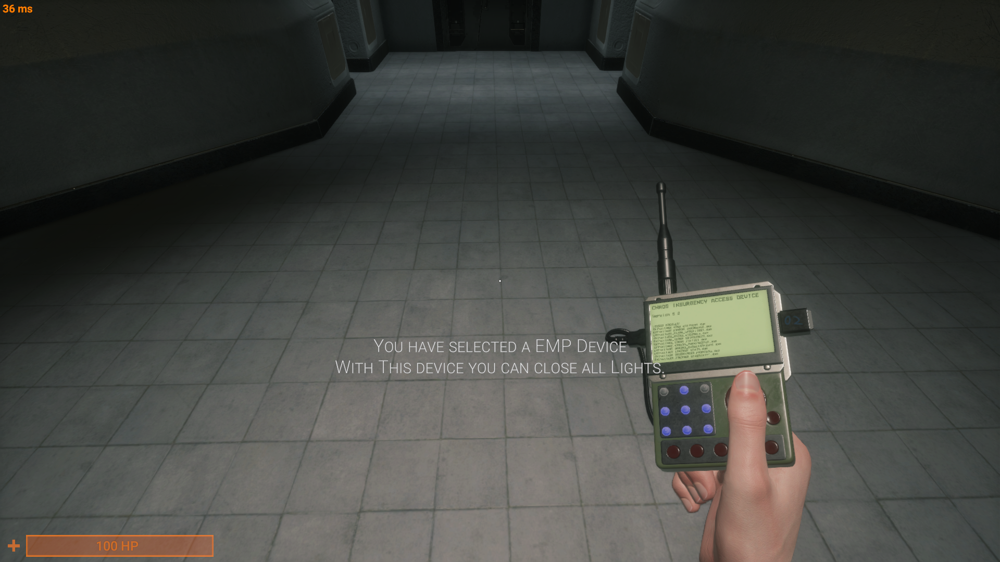
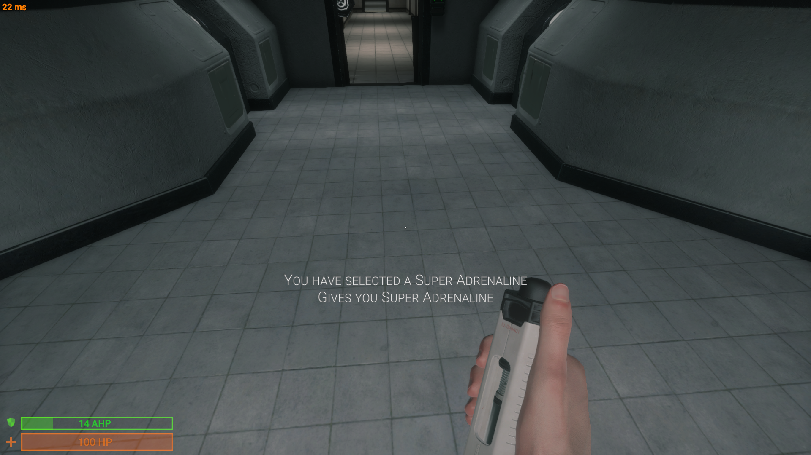
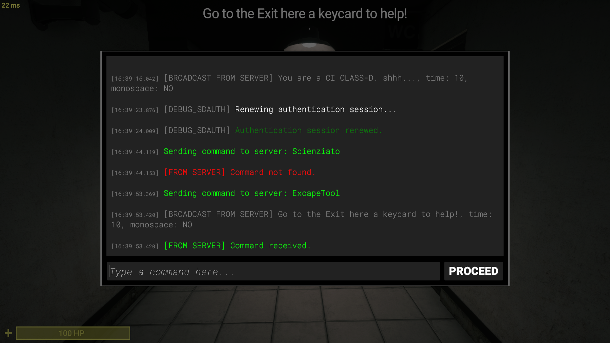
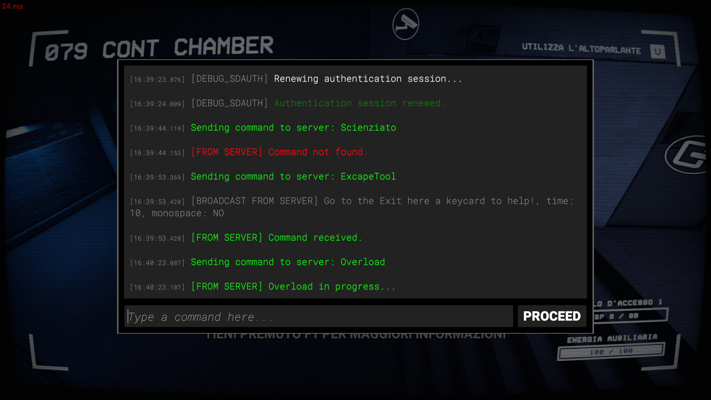

# RPFunctions Plugin.

An new Exiled Plugin By Mr.Cat and FIXI50000 😉

## What this Plugin do?

**This Plugin Add RP Event to make sure that the server
is 100% RolePlay! The Config very argumented for your
customification!**

**This Plugin Specifically add these things to your Server:

- Custom Breach On round started
- Custom Events for Better Content
- Femur Breaker
- Commands for Client and RA for RolePlay
- Omega Warhead in Game! (RA command to start)
- For Better RP we are introducing CustomRoles & CustomItems!
- SCP now are RP! (Like 106 can't open doors.)
- Premium Version for access other Content!
- Custom Weapons!
- Tesla Gate Conditions!
- 914 Event (Kill when player enter in 914 and when it activated The player get killed.)
- SSS for max costumation.**

## Screenshots:
### Omega Warhead:

### Custom Roles:

### Custom Items:

### Custom Commands:

## Support

For support, email: sigmapurgatorium12@outlook.it or server Exiled.

## Authors:

- [@MRCAT9898](https://www.github.com/MRCAT9898)
- [@FIXI50000](https://www.github.com/FIXI50000)

## License

[MIT](https://choosealicense.com/licenses/mit/)

## Badges

Badges: [shields.io](https://shields.io/)

